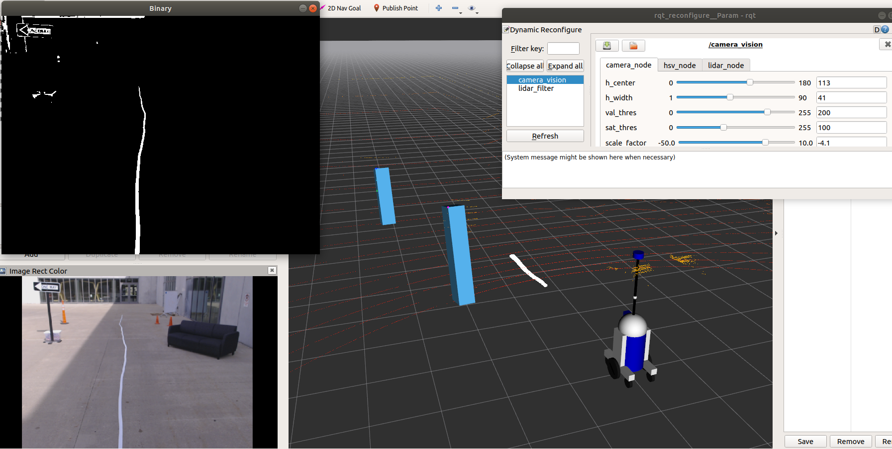
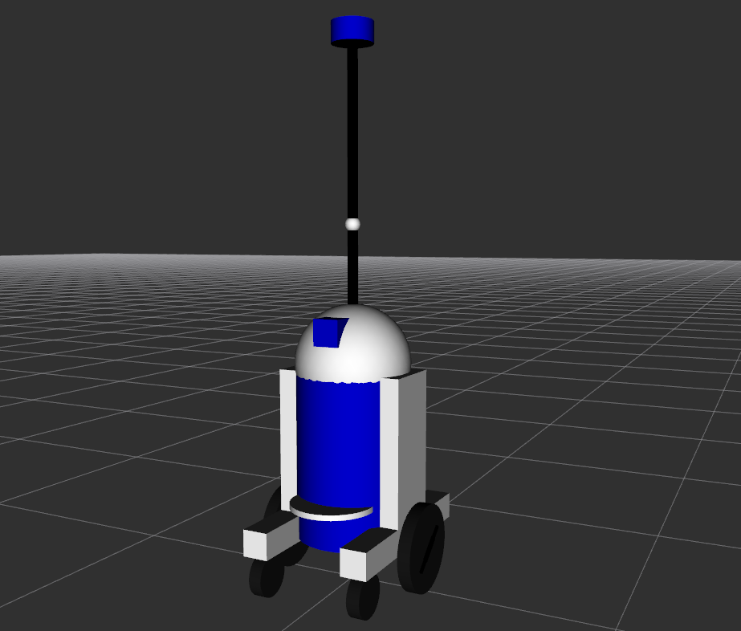
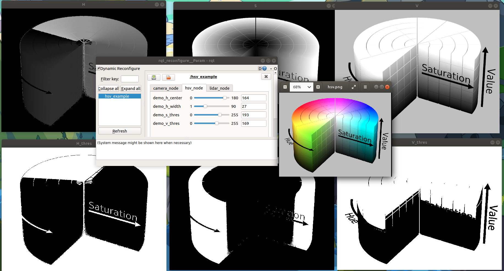

# Golfcart Push
##### Author: Ben Grudzien

I took a bag file of an autonomus golf cart, then used class examples to piece together a cool project. It demonstrates lidar and camera processing in ROS using OpenCV and the PCL library. The lidar uses intensity of points to place bounding boxes on the sign posts. The camera is used to track the line of tape on the ground. The camera image is processed to get 3D information and place PCL points on the tape. Oh also I added the iconic R3D3 (upgrade from R2D2) to this project.

### Instructions

+ Run this to launch the project you see in the image

```
roslaunch golfcart_push svc_bag.launch
```

+ Then run this bag in a second terminal
```
rosbag play --clock moving-002.bag -l
```


+ Run this to see the R3D3 in rviz

```
roslaunch golfcart_push r3d3_model.launch
```


+ Run this to use dynamic reconfigure and observe HSV

```
roslaunch golfcart_push hsv_example.launch
```



